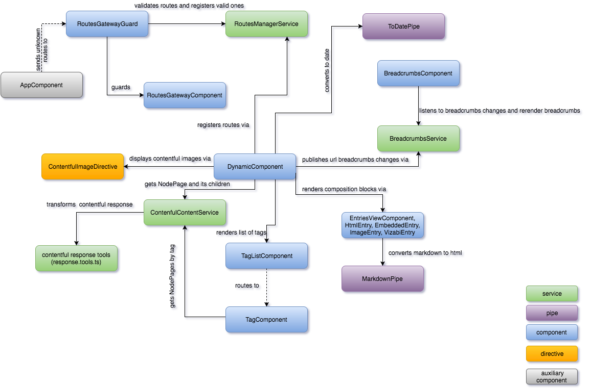
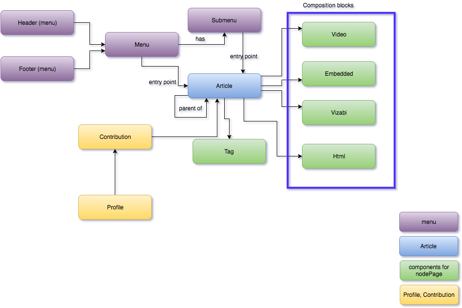
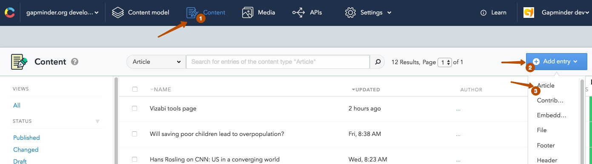
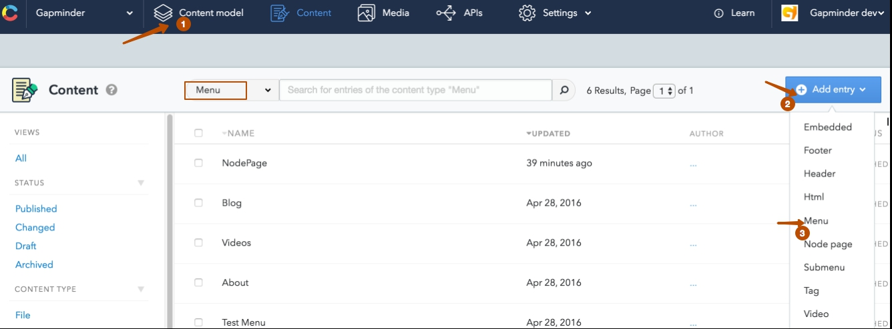
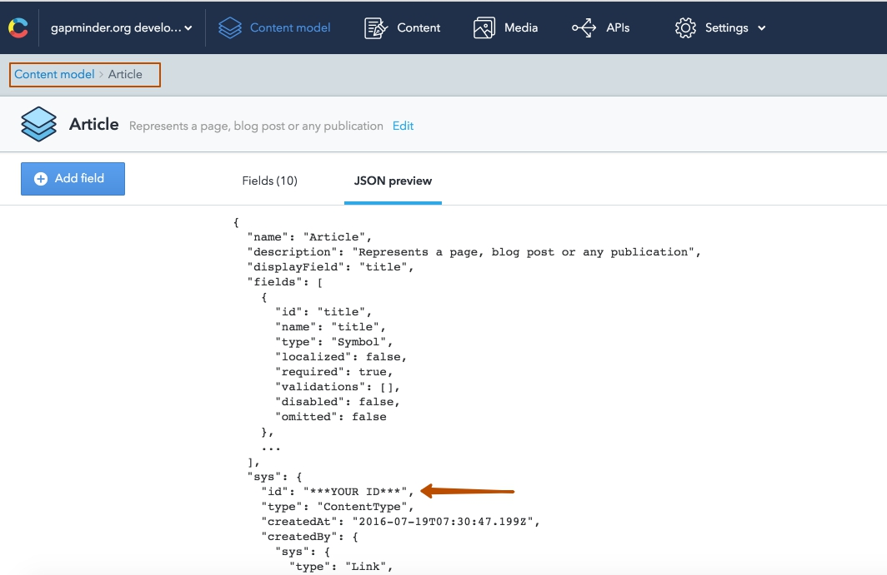

# ng2-contentful-blog

Module for creating a blog using [Contentful](https://www.contentful.com/)

### Components & services

1. HeaderMenuComponent
2. FooterMenuComponent
3. BreadcrumbsService
4. BreadcrumbsComponent
5. RoutesManagerService
6. RoutesGatewayComponent
7. RoutesGatewayGuard
8. ContenfulContent
9. ContentfulImageDirective
10. EmbeddedEntryComponent
11. VizabiEntryComponent
12. HtmlEntryComponent
13. EntriesViewComponent
14. VideoEntryComponent
15. TagsComponent
16. TagComponent
17. MarkdownPipe
18. ToDatePipe
19. ContentfulService
20. ContributorsComponent
21. ProfileComponent


## ng2-contentful-blog components diagram 




## Content model that should exist on Contentful



### `Menu` - includes fields:
  - `title` (`Short text`)
  
    Settings:
      - Check: `This field represents the Entry title`
      - Validations: `This field is required`
      - Appearance: `Single line`
  - `submenus` (`References, many`)
  
    Settings:
      - Validations => Specify allowed entry type: `Submenu`
      - Appearance: `Entry links list`
  - `entryPoint` (`Reference`)
  
    Settings:
      - Validations => Specify allowed entry type: `Article`
      - Appearance: `Entry link`

### `Submenu` - includes fields:
  - `title` (`Short text`)
  
    Settings:
      - Check: `This field represents the Entry title`
      - Validations: `This field is required`
      - Appearance: `Single line`
  - `entryPoint` (`Reference`)
  
    Settings:
      - Validations => Specify allowed entry type: `Article`
      - Appearance: `Entry link`
  - `thumbnail` (`Media`)

### `Header` - includes fields:
  - `title` (`Short text`)
  
    Settings:
      - Check: `This field represents the Entry title`
      - Validations: `This field is required`
      - Appearance: `Single line`
  - `entries` (`References, many`)
  
    Settings:
      - Validations => Specify allowed entry type: `Menu`
      - Appearance: `Entry links list`

### `Footer` - includes fields:
  - `title` (`Short text`)
  
    Settings:
      - Check: `This field represents the Entry title`
      - Validations: `This field is required`
      - Appearance: `Single line`
  - `entries` (`References, many`)
  
    Settings:
      - Validations => Specify allowed entry type: `Menu`
      - Appearance: `Entry links list`

### `Tag` - for creating and attaching tags in `Article`, includes fields:
  - `title` (`Short text`)
  
    Settings:
      - Check: `This field represents the Entry title`
      - Validations: `This field is required`
      - Appearance: `Slug`
  - `slug` (`Short text`)
  
    Settings:
      - Appearance: `Slug`
      
### `Html` - model that it used to create the html blocks for `Article`, includes fields:
  - `title` (`Short text`)
  
    Settings:
      - Check: `This field represents the Entry title`
      - Appearance: `Single line`
  - `content` (`Long text`)
  
    Settings:
      - Appearance: `Markdown`
      
### `Video` - model that it used to create the video blocks (via iframe) for `Article`, includes fields:
  - `title` (`Short text`)
  
    Settings:
      - Check: `This field represents the Entry title`
      - Appearance: `Single line`
  - `description` (`Long text`)
  
    Settings:
      - Appearance: `Markdown`
  - `youtube` (`Short text`)
  - `vimeo` (`Short text`)
  
### `Embedded` - to create a block of any embedded content (via iframe) for `Article`, includes fields: 
  - `title` (`Short text`)
  
    Settings:
      - Check: `This field represents the Entry title`
      - Appearance: `Single line`
  - `link` (`Long text`)
  
    Settings:
      - Validations: `This field is required`
      - Appearance: `Single line`
     
### `Vizabi` - to create a vizabi composition block uses vizabi's `state`, includes fields: 
  - `title` (`Short text`)
  
    Settings:
      - Check: `This field represents the Entry title`
      - Appearance: `Single line`
  - `state` (`Long text`)
  
    Settings:
      - Validations: `This field is required`
      - Appearance: `Single line`
      
### `Article` - blueprint of the page for posts/list of posts, includes fields:

  - `title` (`Short text`)
     
    Settings:
      - Check: `This field represents the Entry title`
      - Validations: `This field is required`
      - Appearance: `single line`
  - `slug` (`Short text`)
         
    Settings:
      - Appearance: `slug`
  - `thumbnail` (`Media`)
  - `description` (`Long text`)
       
    Settings:
      - Appearance: `Markdown`
  - `entries` (`References, many`)
       
     Settings:
       - Validations => Specify allowed entry type: `Html`, `Video`, `Embedded`, `Vizabi`
       - Appearance: `Entry links list`
  - `related` (`References, many`)
      
    Settings:
      - Validations => Specify allowed entry type: `Article`
      - Appearance: `Entry links list`
  - `created at` (`Date & time`)
      
    Settings:
      - Validations: `This field is required`
  - `show in main page slider` (`Boolean`)
  - `parent` (`Reference`)
      
    Settings:
      - Validations => Specify allowed entry type: `Article`
      - Appearance: `Entry link`
  - `tags` (`References, many`)
       
    Settings:
      - Validations => Specify allowed entry type: `Tag`
      - Appearance: `Entry links list` 
    
### `Contribution` - includes fields:

  - `description` (`Long text`)
       
    Settings:
      - Appearance: `Markdown`
  - `article` (`Reference`)
      
    Settings:
      - Validations => Specify allowed entry type: `Article`
      - Appearance: `Entry card`
  
### `Profile` - includes fields:

   - `user name` (`Short text`)
       
      Settings:
        - Check: `This field represents the Entry title`
        - Validations: `This field is required`
        - Appearance: `single line`
   - `first name` (`Short text`)
       
     Settings:
       - Validations: `This field is required`
       - Appearance: `Single line`
   - `last name` (`Short text`)
       
     Settings:
       - Validations: `This field is required`
       - Appearance: `Single line`
   - `avatar` (`Media`)
   - `title` (`Short text`)
          
     Settings:
       - Appearance: `Single line`
   - `location` (`Short text`)
          
     Settings:
       - Appearance: `Single line`
   - `email` (`Short text`)
          
     Settings:
       - Validations: `Match a specific pattern` -> `E-Mail`
       - Appearance: `Single line`
   - `facebook` (`Short text`)
             
     Settings:
       - Appearance: `Single line`
   - `google+` (`Short text`)
             
     Settings:
       - Appearance: `Single line`
   - `linkedin` (`Short text`)
             
     Settings:
       - Appearance: `Single line`
   - `twitter` (`Short text`)
             
     Settings:
       - Appearance: `Single line`
   - `aboute me` (`Long text`)
         
     Settings:
       - Appearance: `Markdown`
   - `contributions` (`References, many`)
         
      Settings:
        - Validations => Specify allowed entry type: `Contribution`
        - Appearance: `Entry links list`
   - `my links` (`References, many`)
        
     Settings:
       - Validations => Specify allowed entry type: `Embedded`, `Html`, `Video`, `Vizabi`
       - Appearance: `Entry links list`


## Basic usage `Article`
Go to `contentful` choose `content` then choose `Add entry` and fill in `Article`, for example:



#### Create first page - Page test
  - `title`: Page test
  - `slug`: page-test
  - `description`: first page
  - `entries` - create new `html`
    
#### Create second page - Sub page
  - `title`: Sub page
  - `slug`: sub-page
  - `description`: Sub page test
  - `entries` - create new `html`
  - `related`: `Page test` 
  - `parent`: `Page test`
  - `tags`: blog

## Basic usage `Menu`
Go to `contentful` choose `content` then choose `Add entry` and fill in `Menu`, for example:



#### Create first menu item 
  - `title`: Menu item
  - `submenus`: select or create `SubMenu`
  
  ***OR***
  
  - `entryPoint`: select or create `Article`
  
  ***Note: priority will be `submenus`***
  
    
#### Create HeaderMenu
  - `title`: HeaderMenu
  - `entries`: `Menu item` (your menu item)

### Demo

1. `git clone git@github.com:VS-work/ng2-contentful-blog.git`
2. in folder `ng2-contentful-blog/demo` - open and edit next files:
  - `contentful.json` - add your accessToken and space
 
     ```typescript
     Ng2ContentfulConfig.config = {
       accessToken: CONTENTFUL_ACCESS_TOKEN,
       space: CONTENTFUL_SPACE_ID,
       host: CONTENTFUL_HOST
     };
     ```
     
  - `contentTypeIds.json` update all id (keys) according to your `content model` => `JSON preview`, for example 
    
    
     Get value from `sys.id` which is `***YOUR ID***` and put into `contentTypeIds.json`:
    
     ```json
     {
       "NODE_PAGE_TYPE_ID": "***YOUR ID***",
       "TAG_TYPE_ID": "***YOUR ID***",
       "VIDEO_TYPE_ID": "***YOUR ID***",
       "HTML_TYPE_ID": "***YOUR ID***",
       "EMBEDDED_TYPE_ID": "***YOUR ID***",
       "PROFILE_TYPE_ID": "***YOUR ID***",
       "CONTRIBUTION_TYPE_ID": "***YOUR ID***",
       "HEADER_TYPE_ID": "***YOUR ID***",
       "FOOTER_TYPE_ID": "***YOUR ID***",
       "VIZABI_TYPE_ID": "***YOUR ID***"
     }

     ```
     
3. `npm i && npm run dev`
4. `localhost:8080/#/*your menu item*` for example `localhost:8080/#/page-test`
