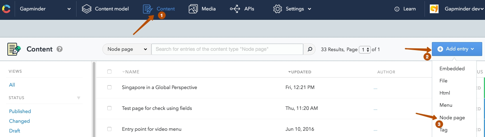
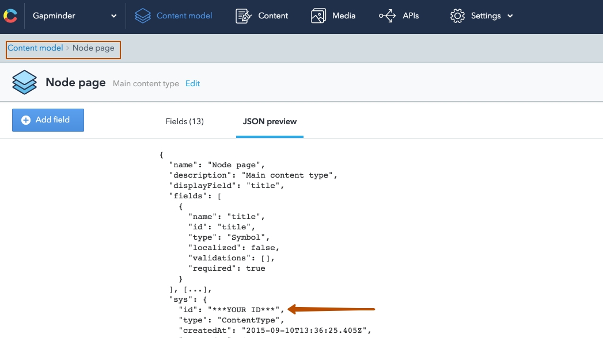

# ng2-gapminder

Module for creating a blog using [Contentful](https://www.contentful.com/)

### Components & services

1. [BreadcrumbsService](./components/breadcrumbs/README.md)
2. [BreadcrumbsComponent](./components/breadcrumbs/README.md)
3. [DynamicRouteConfigurator](./components/routesGateway/README.md)
4. [RoutesGatewayService](./components/routesGateway/README.md)
5. [RoutesGatewayComponent](./components/routesGateway/README.md)
6. ContenfulContent
7. ContentfulImageDirective
8. EmbeddedEntryComponent
9. HtmlEntryComponent
10. EntriesViewComponent
11. VideoEntryComponent
12. TagsComponent
13. TagComponent
14. MarkdownPipe
15. ToDatePipe

## ng2-gapminder components diagram 


## Contentful diagram


### `Tag` - for creating and attaching tags in `NodePage`, includes fields:
  - `name` (`Short text`)
  
    Settings:
      - Check: `This field represents the Entry title`
      - Validations: `This field is required`
      - Appearance: `Slug`
  - `slug` (`Short text`)
  
    Settings:
      - Appearance: `Slug`
      
### `Html` - model that it used to create the html blocks for `NodePage`, includes fields:
  - `name` (`Short text`)
  
    Settings:
      - Check: `This field represents the Entry title`
      - Appearance: `Single line`
  - `content` (`Long text`)
  
    Settings:
      - Appearance: `Markdown`
      
### `Video` - model that it used to create the video blocks (via iframe) for `NodePage`, includes fields:
  - `title` (`Short text`)
  
    Settings:
      - Check: `This field represents the Entry title`
      - Appearance: `Single line`
  - `description` (`Long text`)
  
    Settings:
      - Appearance: `Markdown`
  - `youtube` (`Short text`)
  - `vimeo` (`Short text`)
  
### `Embedded` - to create a block of any embedded content (via iframe) for `NogePage`, includes fields: 
  - `title` (`Short text`)
  
    Settings:
      - Check: `This field represents the Entry title`
      - Appearance: `Single line`
  - `link` (`Long text`)
  
    Settings:
      - Validations: `This field is required`
      - Appearance: `Single line`
      
### `NodePage` - blueprint of the page for posts/list of posts, includes fields:

  - `title` (`Short text`)
     
    Settings:
      - Check: `This field represents the Entry title`
      - Validations: `This field is required`
      - Appearance: `single line`
  - `type` (`Short text`)
     
    Settings:
      - Validations: `Predefined values`
      - Appearance: `Dropdown`
  - `slug` (`Short text`)
         
    Settings:
      - Appearance: `slug`
  - `thumbnail` (`Media`)
  - `description` (`Long text`)
       
    Settings:
      - Appearance: `Markdown`
  - `entries` (`References, many`)
       
     Settings:
       - Validations => Specify allowed entry type: `Html`, `Video`, `Embedded`
       - Appearance: `Entry links list`
  - `Related nodes` (`References, many`)
      
    Settings:
      - Validations => Specify allowed entry type: `NodePage`
      - Appearance: `Entry links list`
  - `createdAt` (`Date & time`)
      
    Settings:
      - Validations: `This field is required`
  - `show in main page slider` (`Boolean`)
  - `parent` (`Reference`)
      
    Settings:
      - Validations => Specify allowed entry type: `NodePage`
      - Appearance: `Entry link`
  - `tags` (`References, many`)
       
    Settings:
      - Validations => Specify allowed entry type: `Tag`
      - Appearance: `Entry links list` 
      

## Basic usage
Go to `contentful` choose `content` then choose `Add entry` and filling `NodePage`, for example:



#### Create first page - Page test
  - `title`: Page test
  - `slug`: page-test
  - `description`: first page
  - `entries` - create new `html`
    
#### Create second page - Sub page
  - `title`: Sub page
  - `slug`: sub-page
  - `description`: Sub page test
  - `entries` - create new `html`
  - `Related nodes`: `Page test` 
  - `parent`: `Page test`
  - `tags`: blog


### Demo

1. `git clone git@github.com:VS-work/ng2-gapminder.git`
2. in folder `ng2-gapminder/demo` - open and edit next files:
  - `contentful.json` - add your accessToken and space
 
     ```typescript
     Ng2ContentfulConfig.config = {
       accessToken: CONTENTFUL_ACCESS_TOKEN,
       space: CONTENTFUL_SPACE_ID,
       host: CONTENTFUL_HOST
     };
     ```
     
  - `constIdContentType.json` update all id (keys) according to your `content model` => `JSON preview`, for example 
    
    
     Get value from `sys.id` which is `***YOUR ID***` and put into app.constans.ts:
    
     ```json
     {
       "CONTENTFUL_NODE_PAGE_TYPE_ID": "***YOUR ID***",
       "CONTENTFUL_TAG_TYPE_ID": "***YOUR ID***",
       "VIDEO_CONTENT_ID": "***YOUR ID***",
       "HTML_CONTENT_ID": "***YOUR ID***",
       "EMBEDDED_CONTENT_ID": "***YOUR ID***"
     }
     ```
     
3. `npm i && npm run dev`
4. `localhost:8080/#/*your slug first level*` for example `localhost:8080/#/page-test`

***Note:  all models that do not have parents - the first level***
